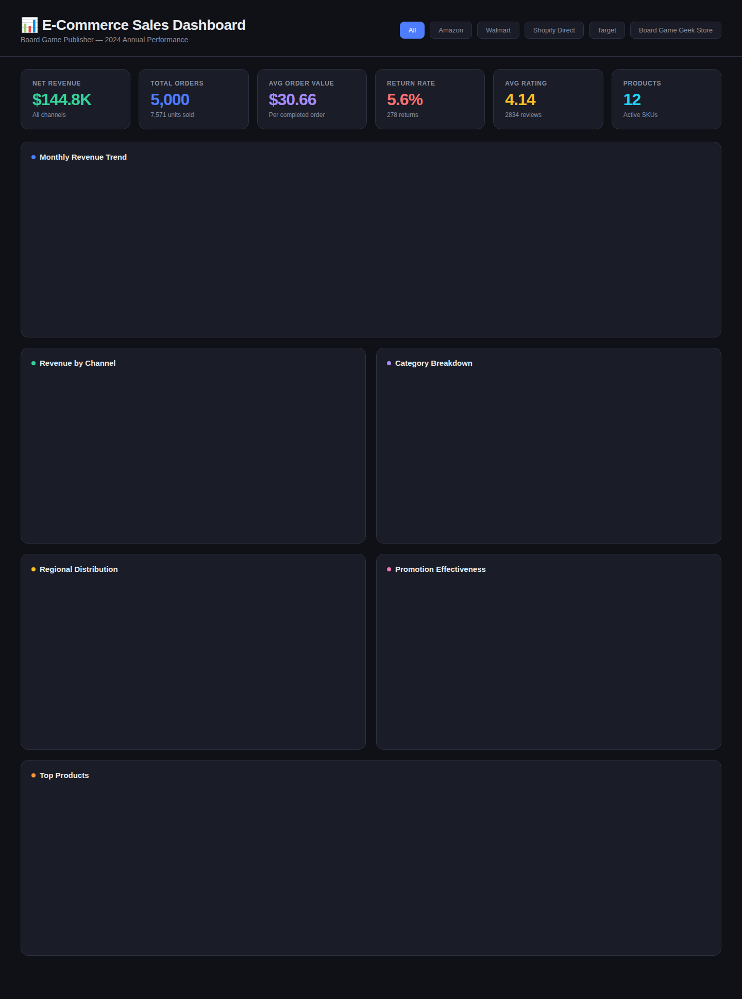

# E-Commerce Sales Dashboard

An interactive data visualization dashboard analyzing 5,000+ e-commerce orders for a board game publisher — built with **Plotly.js** and hosted on **GitHub Pages**.


## 🔗 [View Live Dashboard](https://thebigmanken.github.io/sales-dashboard/)

## Dashboard Preview



## Features

- **6 KPI Cards** — Net revenue, total orders, avg order value, return rate, avg rating, active products
- **Interactive Charts** — Monthly trends, channel breakdown (donut), category comparison, regional distribution, promotion effectiveness with dual-axis
- **Product Leaderboard** — Sortable table with revenue, units, ratings, and return rate flagging
- **Channel Filtering** — Click any channel button to filter the entire dashboard in real time
- **Hover Tooltips** — Detailed data on hover for every chart element
- **Responsive** — Works on desktop, tablet, and mobile
- **Dark Theme** — Professional dark UI built from scratch

## Key Insights

| Metric | Value |
|--------|-------|
| Total Net Revenue | $144.8K |
| Top Channel | Amazon (37% share) |
| Peak Month | December ($19.3K) |
| Best Seller | Cosmic Blitz ($16.3K) |
| Highest Return Rate | Trivia Tornado (7.1%) |
| Avg Customer Rating | 4.14 / 5.0 |

## Tech Stack

- **Plotly.js** — Interactive charts with hover, zoom, pan
- **PapaParse** — Client-side CSV parsing
- **Vanilla JS** — No framework dependencies
- **CSS Grid** — Responsive dashboard layout

## How It Works

The dashboard loads `sales_data_2024.csv` (5,000 orders) directly in the browser using PapaParse, computes all metrics and aggregations in JavaScript, and renders interactive Plotly charts. No backend or build step required.

## Run Locally

```bash
git clone https://github.com/TheBigManKen/sales-dashboard.git
cd sales-dashboard
# Open with any local server:
python -m http.server 8000
# Visit http://localhost:8000
```

## Deploy to GitHub Pages

1. Go to repo Settings → Pages
2. Source: **Deploy from a branch**
3. Branch: **main**, folder: **/ (root)**
4. Save — your dashboard is live at `https://thebigmanken.github.io/sales-dashboard/`

## Data

The dataset contains 5,000 simulated e-commerce orders for a board game publisher across 2024, including:

- 12 products across 4 categories (Strategy, Family, Party, Children)
- 5 sales channels (Amazon, Shopify Direct, Walmart, Target, BGG Store)
- 5 U.S. regions
- Promotions, discounts, returns, and customer ratings

## License

MIT
